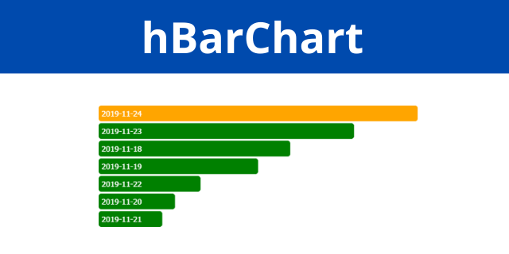

<h1 align="center">Horizontal Bar Chart</h1>
<p align="center">
    <a href="https://creativecommons.org/licenses/by/4.0/"></a>
</p>
<p align="center">A simple horizontal barchart jQuery plugin</p>

### Usages
### Add jQuery
```html
<script src="https://code.jquery.com/jquery-2.2.4.min.js"></script>
<script src="hBarChart.js"></script>
```

### Demo and Documentation
[Click here](https://haruncpi.github.io/hBarChart/)

